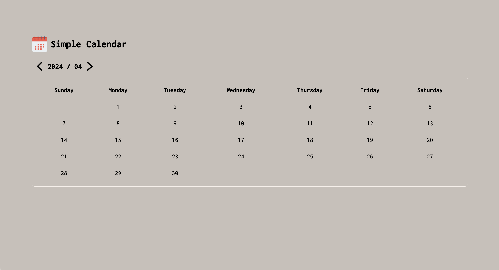

# A simple calendar

## 📋 Description

This is a simple monthly calendar.

## 🔍 Function

Can switch to different months.

## 🛠️ Technologies & Requirements

- HTML
- CS
- JavaScript

## 💻 Demo Screenshot

(Attached is a simple demo)

## 🚀 Getting Started

1. Download ZIP or git clone.

2. Open this project.

3. Click Go Live

## 👤 Author

Email:yiting536@gmail.com

## ⭕️ Warning

This is purely for practice and not for any profit-making purpose.Thanks!
